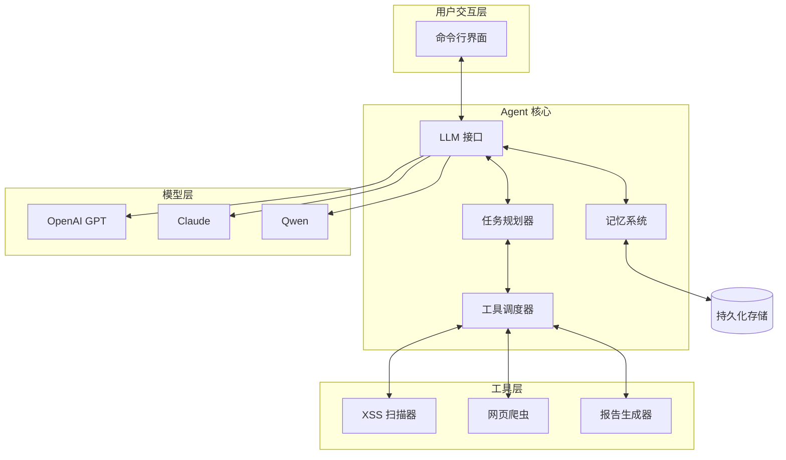
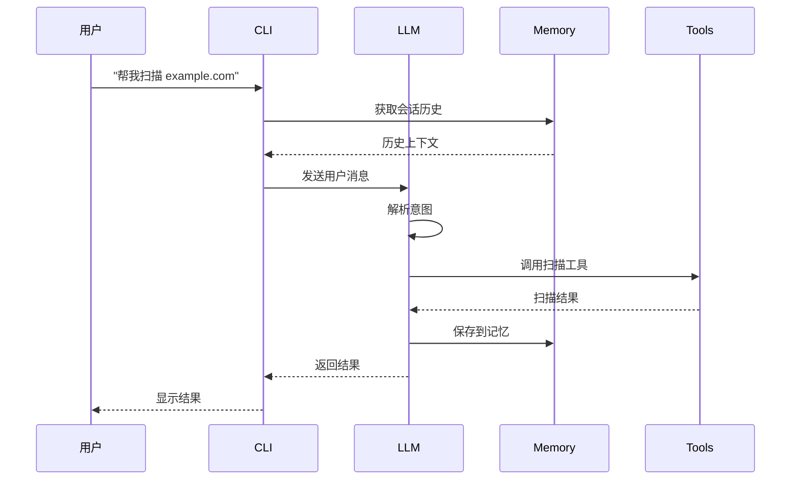
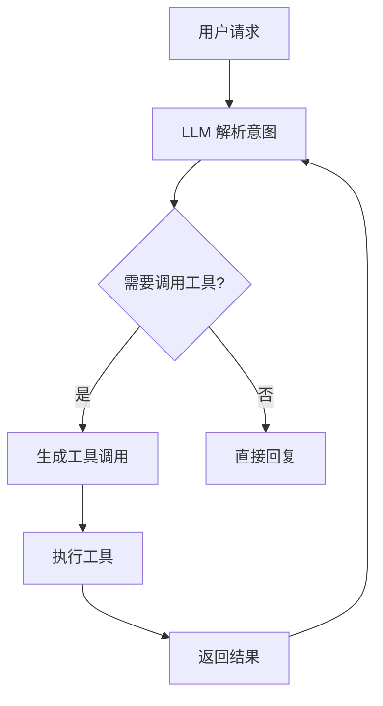

# XSS Scanner AI Agent - 技术设计文档

## 1. 概述

**项目名称**：XSS Scanner AI Agent
**更新日期**：2026-03-20
**项目类型**：智能安全测试 Agent

## 2. 描述

XSS Scanner AI Agent 是一个基于大语言模型的智能安全测试助手，通过自然语言交互帮助用户完成 XSS 漏洞扫描任务。Agent 能够理解用户意图、自主规划任务、调用工具执行、并通过记忆系统保持上下文连贯性。

## 3. 架构设计



## 4. 核心模块

### 4.1 LLM 接口层 (`agent/llm/`)

负责与各种大语言模型 API 交互：

```
agent/llm/
├── __init__.py
├── base.py          # 基类 LLMInterface
├── openai.py        # OpenAI GPT 实现
├── anthropic.py     # Claude 实现
└── dashscope.py     # 阿里 Qwen 实现
```

**接口定义**：

```python
class LLMInterface:
    def chat(self, messages: List[Dict]) -> str:
        """发送对话请求，返回模型响应"""
        pass
    
    def set_api_key(self, api_key: str) -> None:
        """设置 API 密钥"""
        pass
    
    def get_model_name(self) -> str:
        """获取当前模型名称"""
        pass
```

### 4.2 记忆系统 (`agent/memory/`)

负责持久化存储对话历史和用户偏好：

```
agent/memory/
├── __init__.py
├── base.py          # 基类 Memory
├── session.py       # 会话记忆
└── store.py         # 持久化存储
```

**数据结构**：

```python
@dataclass
class MemoryEntry:
    role: str           # "user" | "assistant" | "system"
    content: str
    timestamp: datetime
    metadata: Dict      # 附加信息

@dataclass
class ScanRecord:
    url: str
    timestamp: datetime
    findings: List[Dict]
    auth_type: str
    duration: float
```

### 4.3 工具调度器 (`agent/tools/`)

管理 Agent 可调用的所有工具：

```
agent/tools/
├── __init__.py
├── base.py          # 基类 Tool
├── scanner.py       # XSS 扫描工具
├── crawler.py       # 爬虫工具
└── reporter.py      # 报告生成工具
```

### 4.4 任务规划器 (`agent/planner/`)

将复杂任务分解为可执行的步骤：

```
agent/planner/
├── __init__.py
├── parser.py        # 意图解析
├── planner.py       # 任务规划
└── executor.py      # 执行调度
```

### 4.5 命令行入口 (`agent/cli/`)

提供用户交互界面：

```
agent/cli/
├── __init__.py
├── main.py          # 主入口
├── session.py       # 会话管理
└── formatter.py     # 输出格式化
```

## 5. 项目结构

```
xss_agent/
├── agent/
│   ├── __init__.py
│   ├── llm/
│   │   ├── __init__.py
│   │   ├── base.py
│   │   ├── openai.py
│   │   ├── anthropic.py
│   │   └── dashscope.py
│   ├── memory/
│   │   ├── __init__.py
│   │   ├── base.py
│   │   ├── session.py
│   │   └── store.py
│   ├── tools/
│   │   ├── __init__.py
│   │   ├── base.py
│   │   ├── scanner.py
│   │   ├── crawler.py
│   │   └── reporter.py
│   ├── planner/
│   │   ├── __init__.py
│   │   ├── parser.py
│   │   ├── planner.py
│   │   └── executor.py
│   └── cli/
│       ├── __init__.py
│       ├── main.py
│       ├── session.py
│       └── formatter.py
├── scanner/              # 原有 XSS 扫描器
├── config/
│   └── models.json       # 模型配置
├── data/
│   └── memory.json       # 记忆存储
├── requirements.txt
└── main.py
```

## 6. 配置管理

### 6.1 模型配置 (`config/models.json`)

```json
{
  "default_model": "gpt-4",
  "models": {
    "gpt-4": {
      "provider": "openai",
      "api_key_env": "OPENAI_API_KEY",
      "endpoint": "https://api.openai.com/v1/chat/completions"
    },
    "claude-3": {
      "provider": "anthropic",
      "api_key_env": "ANTHROPIC_API_KEY",
      "endpoint": "https://api.anthropic.com/v1/messages"
    },
    "qwen-plus": {
      "provider": "dashscope",
      "api_key_env": "DASHSCOPE_API_KEY",
      "endpoint": "https://dashscope.aliyuncs.com/api/v1/services/aigc/text-generation/generation"
    }
  }
}
```

### 6.2 环境变量

| 变量名 | 说明 | 必需 |
|--------|------|------|
| `OPENAI_API_KEY` | OpenAI API 密钥 | 是 |
| `ANTHROPIC_API_KEY` | Anthropic API 密钥 | 是 |
| `DASHSCOPE_API_KEY` | 阿里云 API 密钥 | 是 |

## 7. 交互流程

### 7.1 对话流程



### 7.2 工具调用流程



## 8. 记忆系统设计

### 8.1 存储结构

```
data/
├── memory.json      # 主记忆文件
├── history/         # 历史记录
│   └── 2026-03-20_scan_example.com.json
└── preferences.json # 用户偏好
```

### 8.2 记忆类型

| 类型 | 说明 | 持久化 |
|------|------|--------|
| 会话记忆 | 当前对话上下文 | 否 |
| 短期记忆 | 最近 N 条关键交互 | 是 |
| 长期记忆 | 扫描历史、用户偏好 | 是 |

## 9. 工具接口定义

```python
class Tool(ABC):
    name: str
    description: str
    parameters: List[Parameter]
    
    @abstractmethod
    async def execute(self, **kwargs) -> ToolResult:
        """执行工具并返回结果"""
        pass

class XSSScannerTool(Tool):
    name = "xss_scanner"
    description = "扫描网站 XSS 漏洞"
    
    async def execute(self, url: str, auth: AuthInfo = None) -> ToolResult:
        # 调用原有扫描器
        pass

class CrawlerTool(Tool):
    name = "web_crawler"
    description = "爬取网页内容"
    
    async def execute(self, url: str, depth: int = 3) -> ToolResult:
        pass
```

## 10. 错误处理

| 错误类型 | 处理策略 |
|----------|----------|
| API 调用失败 | 切换备用模型，重试 2 次 |
| 工具执行失败 | 返回错误信息给 LLM，让其重新规划 |
| 认证失败 | 提示用户检查配置 |
| 网络超时 | 重试 3 次，超时后返回错误 |

## 11. 系统提示词 (System Prompt)

```python
SYSTEM_PROMPT = """你是一个专业的 XSS 安全测试助手。

你的能力：
1. 理解和执行用户的安全扫描需求
2. 调用各种工具完成扫描任务
3. 解释漏洞原因和修复方法
4. 生成专业的安全报告

工作流程：
1. 理解用户意图
2. 规划任务步骤
3. 调用适当工具
4. 汇总结果并解释

安全准则：
1. 只扫描用户明确授权的目标
2. 不进行任何未经授权的渗透测试
3. 保持专业和客观的安全评估态度
"""
```

## 12. 测试策略

### 12.1 单元测试

- LLM 接口 Mock 测试
- 记忆系统读写测试
- 工具调度测试

### 12.2 集成测试

- 完整对话流程测试
- 多模型切换测试
- 记忆持久化测试

## 13. 依赖项

```
openai>=1.0.0
anthropic>=0.8.0
dashscope>=1.10.0
python-dotenv>=1.0.0
rich>=13.0.0
```
