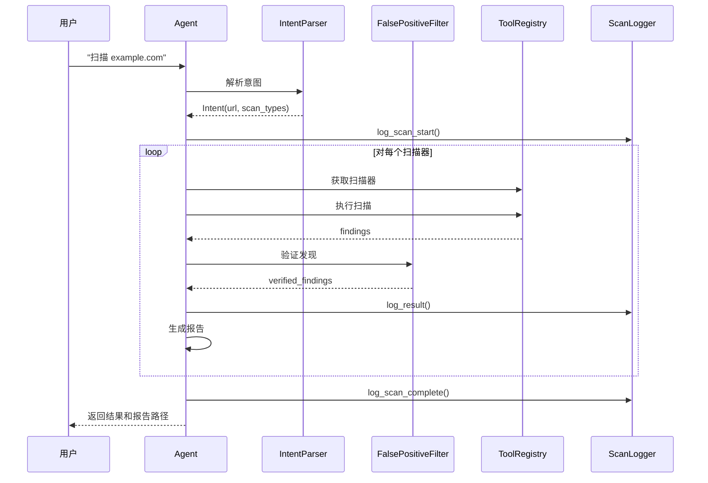

# 安全扫描助手 (Security Scanner Agent)

## 产品概述

安全扫描助手是一款基于大语言模型的智能 Web 安全测试平台。通过自然语言交互，用户可以方便地完成网站漏洞扫描任务，系统会自动选择合适的检测工具、验证扫描结果排除误报，并生成专业的漏洞报告。

---

## 功能特性

| 功能 | 说明 |
|------|------|
| 自然语言交互 | 用日常对话方式下达扫描指令，如"扫描 example.com" |
| 智能路由 | LLM 自动分析用户意图，选择合适的扫描工具 |
| 多漏洞检测 | 支持 9 种 Web 漏洞检测 |
| LLM 误报过滤 | 大模型验证每个发现，自动排除误报 |
| 多格式报告 | 支持 HTML / JSON / Markdown 三种报告格式 |
| 多模型支持 | OpenAI GPT / Claude / 阿里 Qwen |
| 持久化记忆 | 保存扫描历史和用户偏好 |
| 交互式认证 | 支持 Cookie / Token / 用户名密码认证 |
| 完整日志 | 记录从扫描到报告的全过程 |

---

## 支持的漏洞类型

| 漏洞类型 | 命令关键词 | 严重程度 | 说明 |
|----------|------------|----------|------|
| XSS | `xss` | 高/中 | 跨站脚本攻击 |
| SQL 注入 | `sql`, `注入` | 高 | 数据库注入攻击 |
| SSRF | `ssrf` | 高 | 服务端请求伪造 |
| 命令注入 | `命令`, `command` | 高 | OS 命令注入 |
| 路径遍历 | `路径`, `traversal` | 中 | 文件路径遍历 |
| XXE | `xxe` | 高 | XML 外部实体攻击 |
| 敏感信息泄露 | `敏感`, `sensitive` | 中 | API 密钥、密码等泄露 |
| CSRF | `csrf` | 中 | 跨站请求伪造 |
| 开放重定向 | `重定向`, `redirect` | 低 | 钓鱼风险 |

---

## 系统架构

```
┌─────────────────────────────────────────────────────────────────┐
│                         用户交互层                                │
│                   (命令行自然语言输入)                            │
└─────────────────────────────────────────────────────────────────┘
                              │
                              ▼
┌─────────────────────────────────────────────────────────────────┐
│                        Agent 核心层                               │
│  ┌─────────────┐  ┌─────────────┐  ┌─────────────┐              │
│  │ 意图解析器  │  │ 扫描调度器  │  │ 报告生成器  │              │
│  │IntentParser│  │ToolRegistry│  │ReportGenerator│             │
│  └─────────────┘  └─────────────┘  └─────────────┘              │
│         │                                     │                 │
│         ▼                                     ▼                 │
│  ┌─────────────┐                     ┌─────────────┐            │
│  │LLM 误报过滤 │                     │ 日志记录器  │            │
│  │FalsePositiveFilter│                │ScanLogger │            │
│  └─────────────┘                     └─────────────┘            │
└─────────────────────────────────────────────────────────────────┘
                              │
                              ▼
┌─────────────────────────────────────────────────────────────────┐
│                         工具层                                    │
│  ┌─────────────────────────────────────────────────────────────┐│
│  │                 扫描工具注册表 (ToolRegistry)                 ││
│  ├──────────┬──────────┬──────────┬──────────┬──────────┬───────┤│
│  │XSS扫描器│SQL扫描器│SSRF扫描器│命令注入 │路径遍历 │... ││
│  │         │         │         │扫描器   │扫描器  │     ││
│  └──────────┴──────────┴──────────┴──────────┴──────────┴───────┘│
└─────────────────────────────────────────────────────────────────┘
                              │
                              ▼
┌─────────────────────────────────────────────────────────────────┐
│                        模型层                                    │
│              (OpenAI / Claude / DashScope)                      │
└─────────────────────────────────────────────────────────────────┘
```

---

## 代码文件说明

### 1. main.py - 程序入口

**功能**：程序主入口文件，负责初始化环境和启动交互式界面。

**主要逻辑**：
1. 检查 API 密钥环境变量
2. 创建 Agent 实例
3. 启动命令循环，处理用户输入

**对外接口**：
```bash
python main.py
```

---

### 2. agent/core.py - Agent 核心模块

**文件路径**：`agent/core.py`

**功能**：包含 Agent 的所有核心逻辑，是整个系统的调度中心。

**包含类**：

#### 2.1 Intent 类
**功能**：表示解析后的用户意图

| 属性 | 类型 | 说明 |
|------|------|------|
| `action` | str | 动作类型 (scan/help/history) |
| `url` | str | 目标 URL |
| `scan_types` | List[str] | 扫描类型列表 |
| `auth_info` | Dict | 认证信息 |
| `confidence` | float | 解析置信度 |
| `needs_auth_info` | bool | 是否需要认证 |

#### 2.2 IntentParser 类
**功能**：解析用户输入，提取意图信息

| 方法 | 说明 |
|------|------|
| `parse(user_input)` | 使用 LLM 解析用户输入，返回 Intent 对象 |
| `_fallback_parse(user_input)` | 当 LLM 不可用时，使用正则表达式解析 |

#### 2.3 FalsePositiveFilter 类
**功能**：使用 LLM 验证扫描结果，过滤误报

| 方法 | 说明 |
|------|------|
| `filter(findings, scan_type)` | 验证每个发现，返回验证后的结果和判断理由 |

#### 2.4 ReportGenerator 类
**功能**：生成漏洞报告

| 方法 | 说明 |
|------|------|
| `generate(findings, format)` | 根据格式生成报告内容 |
| `generate_and_save(...)` | 生成报告并保存到文件 |

**支持的格式**：`html` / `json` / `markdown`

#### 2.5 Agent 类
**功能**：主 Agent 类，协调各组件工作

| 属性 | 说明 |
|------|------|
| `memory` | 记忆系统实例 |
| `llm` | LLM 接口实例 |
| `tool_registry` | 扫描工具注册表 |
| `parser` | 意图解析器 |
| `false_positive_filter` | 误报过滤器 |
| `report_generator` | 报告生成器 |
| `scan_logger` | 日志记录器 |

| 方法 | 说明 |
|------|------|
| `chat(user_input)` | 处理用户输入，返回响应 |
| `_handle_scan(intent)` | 执行扫描任务 |
| `_handle_auth_input(input)` | 处理认证信息输入 |
| `_general_chat(input)` | 处理通用对话 |
| `_get_help()` | 返回帮助信息 |
| `_get_history()` | 返回扫描历史 |

---

### 3. agent/logger.py - 日志记录模块

**文件路径**：`agent/logger.py`

**功能**：记录扫描任务的完整执行过程。

**ScanLogger 类**：

| 方法 | 说明 |
|------|------|
| `info(msg)` | 记录普通信息 |
| `debug(msg)` | 记录调试信息 |
| `warning(msg)` | 记录警告 |
| `error(msg)` | 记录错误 |
| `critical(msg)` | 记录严重错误 |
| `log_scan_start(url, scan_types)` | 记录扫描开始 |
| `log_intent(intent)` | 记录意图解析结果 |
| `log_auth(auth_type, provided)` | 记录认证方式 |
| `log_scanner_start(name)` | 记录扫描器开始执行 |
| `log_scanner_result(...)` | 记录扫描器结果 |
| `log_llm_verify(count)` | 记录 LLM 验证开始 |
| `log_llm_result(...)` | 记录 LLM 验证结果 |
| `log_report(path, format)` | 记录报告生成 |
| `log_scan_complete(summary)` | 记录扫描完成 |
| `log_error(step, error)` | 记录错误 |
| `log_exception(step, exc)` | 记录异常 |

**日志文件位置**：`./logs/scan_{timestamp}.log`

---

### 4. agent/memory.py - 记忆系统

**文件路径**：`agent/memory.py`

**功能**：管理对话历史、用户偏好和扫描记录的持久化存储。

**包含类**：

#### 4.1 MemoryEntry
**功能**：表示单条记忆条目

| 属性 | 说明 |
|------|------|
| `role` | 角色 (user/assistant) |
| `content` | 内容 |
| `timestamp` | 时间戳 |
| `metadata` | 附加信息 |

#### 4.2 ScanHistory
**功能**：表示扫描记录

| 属性 | 说明 |
|------|------|
| `url` | 目标 URL |
| `timestamp` | 扫描时间 |
| `scan_types` | 扫描类型 |
| `results` | 扫描结果摘要 |
| `auth_type` | 认证方式 |
| `duration` | 耗时 |
| `model_used` | 使用的模型 |

#### 4.3 MemoryStore
**功能**：记忆存储管理

| 方法 | 说明 |
|------|------|
| `add_entry(role, content)` | 添加记忆条目 |
| `get_recent(n)` | 获取最近 n 条记忆 |
| `get_context()` | 获取对话上下文 |
| `add_scan_history(record)` | 添加扫描记录 |
| `get_scan_history(limit)` | 获取扫描历史 |
| `set_preference(key, value)` | 设置偏好 |
| `get_preference(key, default)` | 获取偏好 |
| `clear_memory()` | 清除记忆 |

**存储位置**：`./data/` 目录

---

### 5. agent/llm/ - LLM 接口模块

**目录**：`agent/llm/`

#### 5.1 base.py - LLM 基类和工厂

**LLMInterface 类**：
```python
class LLMInterface(ABC):
    def chat(self, messages, **kwargs) -> str
    def set_api_key(self, api_key: str)
    def get_model_name(self) -> str
```

**LLMFactory 类**：
```python
class LLMFactory:
    @classmethod
    def create(cls, model_name, api_key) -> LLMInterface
```

#### 5.2 openai.py - OpenAI GPT 接口

**OpenAILLM 类**：

| 方法 | 说明 |
|------|------|
| `chat(messages, **kwargs)` | 发送对话请求 |
| `set_api_key(api_key)` | 设置 API 密钥 |

#### 5.3 anthropic.py - Anthropic Claude 接口

**AnthropicLLM 类**：与 OpenAILLM 类似，调用 Claude API

#### 5.4 dashscope.py - 阿里云 DashScope 接口

**DashScopeLLM 类**：调用阿里云通义千问 API

---

### 6. agent/tools/scanner.py - 扫描工具模块

**文件路径**：`agent/tools/scanner.py`

**功能**：定义和管理所有扫描工具。

**包含类**：

#### 6.1 ScanType
**功能**：漏洞类型常量定义

| 常量 | 说明 |
|------|------|
| `XSS` | 跨站脚本 |
| `SQL` | SQL 注入 |
| `SSRF` | 服务端请求伪造 |
| `COMMAND_INJECTION` | 命令注入 |
| `PATH_TRAVERSAL` | 路径遍历 |
| `XXE` | XML 外部实体 |
| `SENSITIVE_INFO` | 敏感信息泄露 |
| `CSRF` | 跨站请求伪造 |
| `OPEN_REDIRECT` | 开放重定向 |

#### 6.2 ScanResult
**功能**：扫描结果数据类

| 属性 | 说明 |
|------|------|
| `success` | 是否成功 |
| `scan_type` | 扫描类型 |
| `data` | 结果数据 |
| `error` | 错误信息 |
| `report_path` | 报告路径 |

#### 6.3 ScannerTool
**功能**：扫描器抽象基类

```python
class ScannerTool(ABC):
    name: str
    description: str
    
    @abstractmethod
    async def scan(self, url: str, **kwargs) -> ScanResult
```

#### 6.4 扫描器实现类

| 类名 | 调用的检测器 |
|------|---------------|
| `XSSTool` | xss_scanner (XSS 检测) |
| `SQLTool` | sql_scanner (SQL 注入检测) |
| `SSRFDetectorTool` | SSRFDetector |
| `CommandInjectionTool` | CommandInjectionDetector |
| `PathTraversalTool` | PathTraversalDetector |
| `XXETool` | XXEDetector |
| `SensitiveInfoTool` | SensitiveInfoDetector |
| `CSRFDetectorTool` | CSRFDetector |
| `OpenRedirectTool` | OpenRedirectDetector |

#### 6.5 ToolRegistry
**功能**：扫描器注册表

| 方法 | 说明 |
|------|------|
| `get(name)` | 获取指定扫描器 |
| `list_tools()` | 列出所有扫描器 |
| `get_all_names()` | 获取所有扫描器名称 |

---

### 7. scanner/detectors/security.py - 漏洞检测器实现

**文件路径**：`scanner/detectors/security.py`

**功能**：实现各种漏洞的具体检测逻辑。

#### 7.1 BaseDetector
**功能**：检测器基类

| 属性 | 说明 |
|------|------|
| `name` | 检测器名称 |
| `description` | 检测器描述 |
| `timeout` | 请求超时时间 |

| 方法 | 说明 |
|------|------|
| `init_client()` | 初始化 HTTP 客户端 |
| `close()` | 关闭客户端 |
| `scan(url, **kwargs)` | 执行扫描 |
| `create_finding(...)` | 创建漏洞发现对象 |
| `inject_param(url, param, payload)` | 注入 payload 到 URL 参数 |
| `get_summary()` | 获取扫描结果摘要 |

#### 7.2 SSRFDetector - 服务端请求伪造检测

**Payload 示例**：
- `http://localhost`
- `http://169.254.169.254` (AWS 元数据)
- `http://metadata.google.internal`

**检测逻辑**：
1. 向目标 URL 的参数注入 SSRF payload
2. 检查响应是否包含内网特征（如 AWS 元数据、localhost 信息）

#### 7.3 CommandInjectionDetector - 命令注入检测

**Payload 示例**：
- `; whoami`
- `| cat /etc/passwd`
- `&& sleep 5`
- `$(whoami)`

**检测逻辑**：
1. 注入命令注入 payload 到参数
2. 检查响应是否包含系统用户信息（root:, bin:, daemon:）

#### 7.4 PathTraversalDetector - 路径遍历检测

**Payload 示例**：
- `../etc/passwd`
- `..%2F..%2Fetc%2Fpasswd`
- `C:\Windows\System32\drivers\etc\hosts`

**检测逻辑**：
1. 注入路径遍历 payload
2. 检查响应是否包含敏感文件内容

#### 7.5 XXEDetector - XML 外部实体检测

**Payload 示例**：
```xml
<?xml version="1.0"?>
<!DOCTYPE foo [<!ENTITY xxe SYSTEM "file:///etc/passwd">]>
<foo>&xxe;</foo>
```

**检测逻辑**：
1. 发送 XXE payload 到 XML 端点
2. 检查响应是否泄露文件内容

#### 7.6 SensitiveInfoDetector - 敏感信息泄露检测

**检测类型**：
| 类型 | 正则模式 |
|------|----------|
| API Key | `api[_-]?key.*[a-zA-Z0-9]{20,}` |
| AWS Key | `AKIA[0-9A-Z]{16}` |
| JWT | `eyJ[a-zA-Z0-9_-]*\.eyJ[a-zA-Z0-9_-]*\.[a-zA-Z0-9_-]*` |
| 私钥 | `-----BEGIN.*PRIVATE KEY-----` |
| 密码 | `password.*[a-zA-Z0-9]{6,}` |
| 数据库连接 | `mysql://`, `postgresql://`, `mongodb://` |

**检测逻辑**：
1. 获取页面响应
2. 使用正则匹配敏感信息模式

#### 7.7 CSRFDetector - CSRF 漏洞检测

**检测逻辑**：
1. 提取页面中的所有表单
2. 检查表单是否包含 CSRF Token

**Token 特征字段名**：`csrf`, `token`, `_token`, `xsrf`

#### 7.8 OpenRedirectDetector - 开放重定向检测

**Payload 示例**：
- `https://evil.com`
- `//evil.com`
- `javascript://alert(1)`

**检测逻辑**：
1. 注入重定向 payload 到参数
2. 检查响应是否发生重定向到恶意域名

---

## 使用方法

### 安装

```bash
cd unified_agent
pip install -r requirements.txt
```

### 配置 API 密钥

```bash
export OPENAI_API_KEY="sk-..."       # OpenAI GPT
export ANTHROPIC_API_KEY="sk-ant-..." # Anthropic Claude
export DASHSCOPE_API_KEY="sk-..."     # 阿里云 Qwen
```

### 启动

```bash
python main.py
```

### 命令示例

| 命令 | 说明 |
|------|------|
| `扫描 https://example.com` | 扫描 XSS 和 SQL 注入 |
| `全面检测 https://example.com` | 扫描全部 9 种漏洞 |
| `只扫 XSS` | 只扫描 XSS |
| `检测 SSRF` | 只扫描 SSRF |
| `生成 JSON 报告` | 输出 JSON 格式 |
| `扫描需要登录的网站` | 交互式输入认证信息 |

---

## 工作流程



---

## 输出文件

### 报告文件 (`./reports/`)

| 格式 | 文件名示例 | 说明 |
|------|------------|------|
| HTML | `xss_report_20260320_143052.html` | 美观的网页报告 |
| JSON | `sql_report_20260320_143052.json` | 结构化数据 |
| Markdown | `ssrf_report_20260320_143052.md` | Markdown 格式 |

### 日志文件 (`./logs/`)

```
scan_20260320_143052.log
```

### 记忆文件 (`./data/`)

| 文件 | 说明 |
|------|------|
| `memory.json` | 对话历史 |
| `preferences.json` | 用户偏好 |
| `history.json` | 扫描历史 |

---

## 错误处理

| 错误类型 | 处理方式 |
|----------|----------|
| API 调用失败 | 切换备用模型或返回错误信息 |
| 扫描器执行失败 | 记录日志，返回错误给用户 |
| 网络超时 | 重试 3 次后记录错误 |
| LLM 验证超时 | 使用"未启用LLM验证"标记 |

---

## 配置说明

### 模型配置 (config/models.json)

```json
{
  "default_model": "gpt-4",
  "models": {
    "gpt-4": {
      "provider": "openai",
      "api_key_env": "OPENAI_API_KEY",
      "endpoint": "https://api.openai.com/v1/chat/completions"
    }
  }
}
```

---

## 环境变量

| 变量 | 说明 | 必需 |
|------|------|------|
| `OPENAI_API_KEY` | OpenAI API 密钥 | 是 |
| `ANTHROPIC_API_KEY` | Anthropic API 密钥 | 否 |
| `DASHSCOPE_API_KEY` | 阿里云 API 密钥 | 否 |

---

## 依赖说明

| 依赖 | 版本 | 说明 |
|------|------|------|
| httpx | >=0.25.0 | 异步 HTTP 客户端 |
| beautifulsoup4 | >=4.12.0 | HTML 解析 |
| jinja2 | >=3.1.0 | 模板引擎 |
| lxml | >=4.9.0 | XML/HTML 解析 |
| openai | >=1.0.0 | OpenAI API 客户端 |
| anthropic | >=0.8.0 | Anthropic API 客户端 |
| dashscope | >=1.10.0 | 阿里云 API 客户端 |
| python-dotenv | >=1.0.0 | 环境变量管理 |

---

## 免责声明

本工具仅用于授权的安全测试和渗透测试。使用本工具扫描未授权的网站是违法行为。使用者需自行承担使用本工具的风险和责任。

---

## 许可证

MIT License
