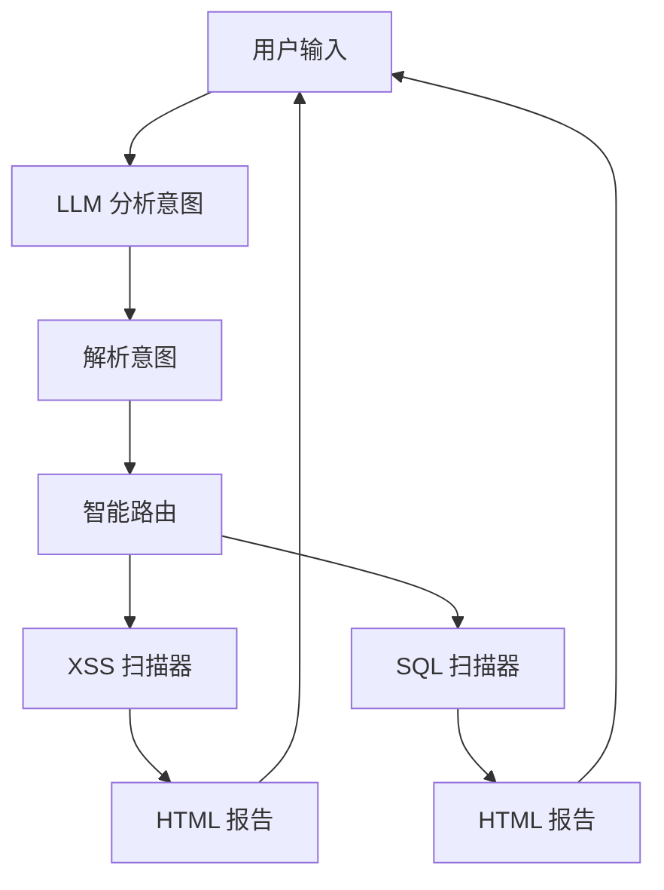

# 安全扫描助手 (Security Scanner Agent)

统一的智能安全扫描平台，通过自然语言交互，自动选择合适的扫描工具检测 Web 应用漏洞。

## 功能特性

- **智能路由**：大模型自动分析需求，选择合适的扫描工具
- **多漏洞检测**：支持 XSS、SQL 注入等多种漏洞检测
- **自然语言交互**：用日常对话方式下达扫描指令
- **多模型支持**：OpenAI GPT、Claude、阿里 Qwen
- **持久化记忆**：保存扫描历史和用户偏好
- **HTML 报告**：生成美观的漏洞报告

## 支持的扫描类型

| 扫描类型 | 说明 | 漏洞数量 |
|----------|------|----------|
| XSS | 跨站脚本漏洞 | 21+ payload |
| SQL 注入 | SQL 注入漏洞 | 50+ payload |

## 安装

```bash
cd unified_agent
pip install -r requirements.txt
```

## 快速开始

```bash
export OPENAI_API_KEY="sk-your-key"  # 或 ANTHROPIC_API_KEY / DASHSCOPE_API_KEY
python main.py
```

## 对话示例

```
> 扫描 example.com
[*] 开始 XSS 扫描: https://example.com
[+] XSS 扫描完成!
    漏洞总数: 3
    高危: 1 | 中危: 2 | 低危: 0
    报告: ./reports/xss_report_xxx.html

[*] 开始 SQL 扫描: https://example.com
[+] SQL 扫描完成!
    漏洞总数: 1
    高危: 1 | 中危: 0 | 低危: 0
    报告: ./reports/sql_report_xxx.html
```

## 命令示例

| 命令 | 说明 |
|------|------|
| `扫描 example.com` | 自动选择所有扫描器 |
| `只扫 XSS` | 只扫描 XSS 漏洞 |
| `检测 SQL 注入` | 只扫描 SQL 注入 |
| `全面检测网站` | 自动选择所有扫描器 |
| `查看扫描历史` | 显示历史记录 |

## 工作原理



## 项目结构

```
unified_agent/
├── main.py                 # 入口
├── requirements.txt        # 依赖
├── agent/
│   ├── core.py            # Agent 核心
│   ├── memory.py          # 记忆系统
│   ├── llm/              # LLM 接口
│   └── tools/             # 扫描工具
├── config/
│   └── models.json        # 模型配置
└── data/                  # 数据存储
```

## 环境变量

| 变量 | 说明 |
|------|------|
| `OPENAI_API_KEY` | OpenAI API 密钥 |
| `ANTHROPIC_API_KEY` | Anthropic API 密钥 |
| `DASHSCOPE_API_KEY` | 阿里云 API 密钥 |

## 免责声明

本工具仅用于授权的安全测试。使用本工具扫描未授权的网站是违法行为。

## 许可证

MIT License
