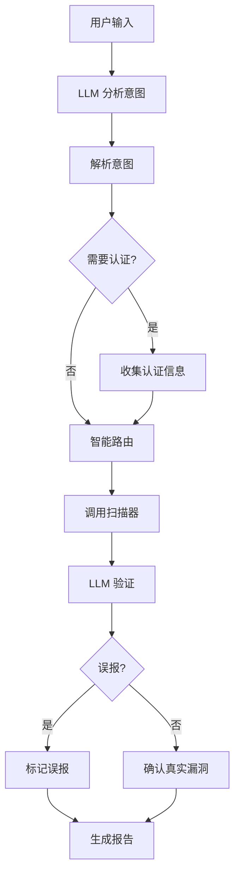

# 安全扫描助手 (Security Scanner Agent)

统一的智能安全扫描平台，通过自然语言交互，自动选择合适的扫描工具检测 Web 应用漏洞。

## 功能特性

- **智能路由**：大模型自动分析需求，选择合适的扫描工具
- **多漏洞检测**：支持 9 种 Web 漏洞检测
- **LLM 误报过滤**：大模型验证每个发现，排除误报
- **多格式报告**：HTML / JSON / Markdown 报告
- **自然语言交互**：用日常对话方式下达扫描指令
- **多模型支持**：OpenAI GPT / Claude / 阿里 Qwen
- **持久化记忆**：保存扫描历史和用户偏好
- **交互式认证**：支持 Cookie、Token、用户名密码多种认证方式
- **完整日志**：记录从扫描到报告的全过程日志

## 支持的扫描类型

| 漏洞类型 | 命令关键词 | 严重程度 | 说明 |
|----------|------------|----------|------|
| XSS | `xss` | 高/中 | 跨站脚本攻击 |
| SQL 注入 | `sql`, `注入` | 高 | 数据库注入攻击 |
| SSRF | `ssrf` | 高 | 服务端请求伪造 |
| 命令注入 | `命令`, `command` | 高 | OS 命令注入 |
| 路径遍历 | `路径`, `traversal` | 中 | 文件路径遍历 |
| XXE | `xxe` | 高 | XML 外部实体攻击 |
| 敏感信息泄露 | `敏感`, `sensitive` | 中 | API 密钥、密码等泄露 |
| CSRF | `csrf` | 中 | 跨站请求伪造 |
| 开放重定向 | `重定向`, `redirect` | 低 | 钓鱼风险 |

## 安装

```bash
cd unified_agent
pip install -r requirements.txt
```

## 快速开始

```bash
export OPENAI_API_KEY="sk-your-key"  # 或 ANTHROPIC_API_KEY / DASHSCOPE_API_KEY
python main.py
```

## 使用方法

### 全面扫描

```
> 全面检测 example.com
> 扫描 example.com
```

### 指定扫描类型

```
> 只扫 XSS
> 检测 SQL 注入
> 检测 SSRF 和 XXE
> 检测敏感信息泄露
```

### 多格式报告

```
> 扫描 example.com，生成 JSON 报告
> 扫描 example.com，生成 Markdown 报告
```

### 需要认证的网站

```
> 扫描需要登录的网站
请提供登录信息：
  - 登录页面 URL
  - 用户名
  - 密码
```

### 其他命令

```
> 查看扫描历史
> 帮助
> exit
```

## 命令示例

| 命令 | 说明 |
|------|------|
| `扫描 example.com` | 自动选择所有扫描器 |
| `全面检测网站` | 扫描全部 9 种漏洞 |
| `只扫 XSS` | 只扫描 XSS 漏洞 |
| `检测 SSRF 和 XXE` | 指定扫描特定漏洞 |
| `检测敏感信息泄露` | 检测 API 密钥、密码等 |
| `生成 JSON 报告` | 输出 JSON 格式 |
| `扫描需要登录的网站` | 交互式认证 |

## 工作流程



## 认证方式

### 1. 用户名密码登录

Agent 会交互式询问：
- 登录页面 URL
- 用户名
- 密码

### 2. Cookie 认证

直接提供登录后的 Cookie：
```
PHPSESSID=abc123; user_token=xyz
```

### 3. Bearer Token

提供 API Token：
```
eyJhbGciOiJIUzI1NiIsInR5cCI6IkpXVCJ9...
```

## 报告格式

### HTML 报告

美观的网页报告，包含漏洞统计和详情。

### JSON 报告

结构化数据报告，适合程序处理：

```json
{
  "summary": {
    "total": 5,
    "high": 2,
    "medium": 2,
    "low": 1,
    "verified": 4,
    "false_positives": 1
  },
  "findings": [
    {
      "url": "https://example.com",
      "param": "q",
      "payload": "<script>alert(1)</script>",
      "severity": "high",
      "is_false_positive": false,
      "reason": "LLM验证为真实漏洞"
    }
  ]
}
```

### Markdown 报告

Markdown 格式，适合文档使用。

## 项目结构

```
unified_agent/
├── main.py                    # 入口
├── requirements.txt          # 依赖
├── agent/
│   ├── core.py              # Agent 核心 + 意图解析 + 报告生成
│   ├── memory.py            # 记忆系统
│   ├── llm/                 # LLM 接口
│   │   ├── base.py
│   │   ├── openai.py
│   │   ├── anthropic.py
│   │   └── dashscope.py
│   ├── tools/               # 扫描工具
│   │   └── scanner.py
│   └── scanner/
│       └── detectors/
│           └── security.py  # 多种漏洞检测器
├── config/
│   └── models.json          # 模型配置
└── data/                    # 数据存储
```

## 环境变量

| 变量 | 说明 | 必需 |
|------|------|------|
| `OPENAI_API_KEY` | OpenAI API 密钥 | 是 |
| `ANTHROPIC_API_KEY` | Anthropic API 密钥 | 是 |
| `DASHSCOPE_API_KEY` | 阿里云 API 密钥 | 是 |

## 数据持久化

对话历史和扫描记录保存在 `data/` 目录：

```bash
data/
├── memory.json       # 对话上下文
├── preferences.json  # 用户偏好
└── history.json     # 扫描历史
```

## 日志记录

扫描日志保存在 `logs/` 目录，记录完整的扫描过程：

```bash
logs/
└── scan_20260320_143052.log  # 每次扫描一个日志文件
```

**日志内容**：
- 扫描开始/完成时间
- 目标 URL 和扫描类型
- 意图解析详情
- 认证方式
- 每个扫描器的执行结果
- LLM 验证详情
- 报告生成路径
- 错误和异常信息

**日志格式**：
```
2026-03-20 14:30:52 | INFO     | ==========================================================
2026-03-20 14:30:52 | INFO     | 扫描任务开始
2026-03-20 14:30:52 | INFO     | 目标 URL: https://example.com
2026-03-20 14:30:52 | INFO     | 扫描类型: xss, sql
2026-03-20 14:30:53 | INFO     | 开始执行扫描器: xss_scanner
2026-03-20 14:30:55 | INFO     | LLM 验证完成: 3 个真实漏洞, 1 个误报
2026-03-20 14:30:56 | INFO     | 报告已生成: ./reports/xss_report_xxx.html (格式: html)
```

## 免责声明

本工具仅用于授权的安全测试和渗透测试。使用本工具扫描未授权的网站是违法行为，使用者需自行承担使用本工具的风险和责任。

## 许可证

MIT License
