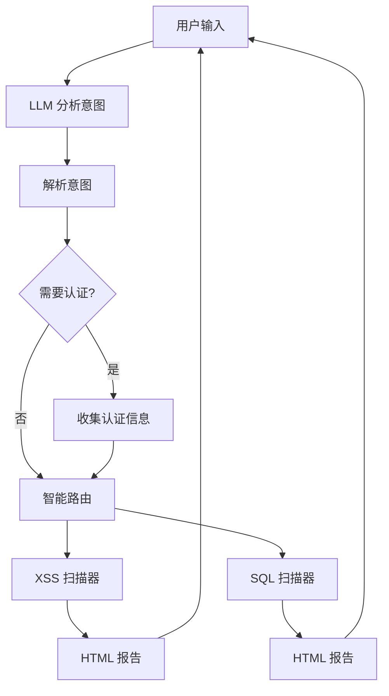

# 安全扫描助手 (Security Scanner Agent)

统一的智能安全扫描平台，通过自然语言交互，自动选择合适的扫描工具检测 Web 应用漏洞。

## 功能特性

- **智能路由**：大模型自动分析需求，选择合适的扫描工具
- **多漏洞检测**：支持 XSS、SQL 注入等多种漏洞检测
- **自然语言交互**：用日常对话方式下达扫描指令
- **多模型支持**：OpenAI GPT、Claude、阿里 Qwen
- **持久化记忆**：保存扫描历史和用户偏好
- **交互式认证**：支持 Cookie、Token、用户名密码多种认证方式
- **HTML 报告**：生成美观的漏洞报告

## 支持的扫描类型

| 扫描类型 | 说明 | Payload 数量 |
|----------|------|--------------|
| XSS | 跨站脚本漏洞 | 21+ |
| SQL 注入 | SQL 注入漏洞 | 50+ |

## 安装

```bash
cd unified_agent
pip install -r requirements.txt
```

## 快速开始

```bash
export OPENAI_API_KEY="sk-your-key"  # 或 ANTHROPIC_API_KEY / DASHSCOPE_API_KEY
python main.py
```

## 使用方法

### 基本扫描

```
> 扫描 example.com
[*] 开始 XSS 扫描: https://example.com
[+] XSS 扫描完成!
    漏洞总数: 3
    高危: 1 | 中危: 2 | 低危: 0
    报告: ./reports/xss_report_xxx.html

[*] 开始 SQL 扫描: https://example.com
[+] SQL 扫描完成!
    漏洞总数: 1
    高危: 1 | 中危: 0 | 低危: 0
    报告: ./reports/sql_report_xxx.html
```

### 指定扫描类型

```
> 只扫 XSS
> 只检测 SQL 注入
> 全面检测网站
```

### 需要认证的网站

```
> 扫描需要登录的网站
请提供登录信息：

方式1: 用户名密码登录
  - 登录页面 URL
  - 用户名
  - 密码

方式2: Cookie 认证
  - 提供完整的 Cookie 字符串

方式3: Bearer Token
  - 提供 Token 值

输入 "取消" 终止操作

> https://example.com/login
请输入用户名：
> admin
请输入密码：
> ******
[*] 开始 XSS 扫描...
```

### 使用 Cookie

```
> 用 Cookie 扫描
> https://example.com
> PHPSESSID=abc123; token=xyz789
```

### 其他命令

```
> 查看扫描历史
> 帮助
> exit
```

## 命令示例

| 命令 | 说明 |
|------|------|
| `扫描 example.com` | 自动选择所有扫描器 |
| `只扫 XSS` | 只扫描 XSS 漏洞 |
| `检测 SQL 注入` | 只扫描 SQL 注入 |
| `全面检测网站` | 自动选择所有扫描器 |
| `扫描需要登录的网站` | 交互式输入登录信息 |
| `用 Cookie 扫描` | 使用 Cookie 认证 |
| `查看扫描历史` | 显示历史记录 |

## 认证方式

### 1. 用户名密码登录

Agent 会交互式询问：
- 登录页面 URL
- 用户名
- 密码

### 2. Cookie 认证

直接提供登录后的 Cookie：
```
PHPSESSID=abc123; user_token=xyz
```

### 3. Bearer Token

提供 API Token：
```
eyJhbGciOiJIUzI1NiIsInR5cCI6IkpXVCJ9...
```

## 工作原理



## 项目结构

```
unified_agent/
├── main.py                 # 入口
├── requirements.txt        # 依赖
├── agent/
│   ├── core.py            # Agent 核心 + 意图解析
│   ├── memory.py          # 记忆系统
│   ├── llm/              # LLM 接口
│   │   ├── base.py
│   │   ├── openai.py
│   │   ├── anthropic.py
│   │   └── dashscope.py
│   └── tools/             # 扫描工具
│       └── scanner.py
├── config/
│   └── models.json        # 模型配置
└── data/                  # 数据存储
    ├── memory.json         # 对话记忆
    ├── preferences.json   # 用户偏好
    └── history.json       # 扫描历史
```

## 环境变量

| 变量 | 说明 | 必需 |
|------|------|------|
| `OPENAI_API_KEY` | OpenAI API 密钥 | 是 |
| `ANTHROPIC_API_KEY` | Anthropic API 密钥 | 是 |
| `DASHSCOPE_API_KEY` | 阿里云 API 密钥 | 是 |

## 数据持久化

对话历史和扫描记录保存在 `data/` 目录：

```bash
data/
├── memory.json       # 对话上下文
├── preferences.json  # 用户偏好（默认模型等）
└── history.json      # 扫描历史
```

## 免责声明

本工具仅用于授权的安全测试和渗透测试。使用本工具扫描未授权的网站是违法行为。使用者需自行承担使用本工具的风险和责任。

## 许可证

MIT License
