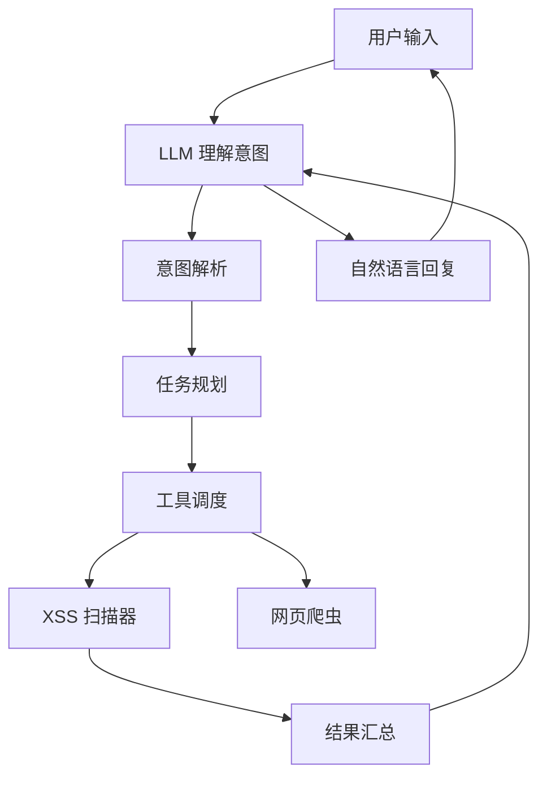

# XSS Scanner AI Agent

基于大语言模型的智能 XSS 漏洞扫描助手，通过自然语言交互帮助你完成安全测试任务。

## 功能特性

- **自然语言交互**：用日常对话方式下达扫描指令，无需记忆复杂命令
- **多模型支持**：支持 OpenAI GPT、Claude、阿里 Qwen 等大语言模型
- **智能任务规划**：自动分解复杂任务，选择合适的工具执行
- **持久化记忆**：保存扫描历史和用户偏好，跨会话保持上下文
- **工具自动调用**：根据意图自动调用扫描器、爬虫等工具
- **专业漏洞报告**：生成 HTML 格式的安全漏洞报告

## 安装

### 环境要求

- Python 3.8+
- 至少一个 LLM API 密钥

### 安装依赖

```bash
cd xss_agent
pip install -r requirements.txt
```

### 配置 API 密钥

选择以下任一方式配置：

**方式 1：环境变量（推荐）**

```bash
export OPENAI_API_KEY="sk-..."       # OpenAI GPT
export ANTHROPIC_API_KEY="sk-ant-..." # Anthropic Claude
export DASHSCOPE_API_KEY="sk-..."     # 阿里云 Qwen
```

**方式 2：运行时传入**

```python
from agent import Agent
agent = Agent(api_key="your-api-key")
```

## 快速开始

```bash
cd xss_agent
export OPENAI_API_KEY="sk-your-key"
python main.py
```

启动后进入交互式对话：

```
==================================================
XSS Scanner AI Agent
==================================================

输入你的问题或命令，输入 'exit' 退出

> 帮我扫描 example.com
> 扫描需要登录的网站
> 切换到 Claude 模型
> 查看我的扫描历史
```

## 对话示例

### 扫描网站

```
> 帮我扫描 example.com
好的，我来帮你扫描 https://example.com 的 XSS 漏洞...

[*] 执行任务: 扫描 https://example.com 的 XSS 漏洞
[+] xss_scanner 执行成功
    漏洞总数: 3, 高危: 1, 中危: 2, 低危: 0
    报告: ./reports/xss_report_20260320_143052.html
```

### 扫描需要登录的系统

```
> 帮我扫描内部系统，需要登录
请提供登录信息：
- 登录页面 URL: https://internal.example.com/login
- 用户名: admin
- 密码: ******

[*] 执行任务: 登录并扫描内部系统
[+] xss_scanner 执行成功
    漏洞总数: 1, 高危: 1
```

### 切换模型

```
> 切换到 Claude 模型
已切换到 claude-3-opus 模型
```

### 查看历史

```
> 查看我的扫描历史

扫描历史：
1. https://example.com
   时间: 2026-03-20 14:30
   漏洞: 3 个
   耗时: 45.2秒
   模型: gpt-4

2. https://test.com
   时间: 2026-03-20 10:15
   漏洞: 0 个
   耗时: 30.1秒
   模型: gpt-4
```

## 支持的模型

| 模型 | 提供商 | 配置名 |
|------|--------|--------|
| GPT-4 | OpenAI | `gpt-4` |
| GPT-4 Turbo | OpenAI | `gpt-4-turbo` |
| GPT-3.5 Turbo | OpenAI | `gpt-3.5-turbo` |
| Claude 3 Opus | Anthropic | `claude-3-opus` |
| Claude 3 Sonnet | Anthropic | `claude-3-sonnet` |
| Qwen Plus | 阿里云 | `qwen-plus` |
| Qwen Turbo | 阿里云 | `qwen-turbo` |

## 认证方式

Agent 支持多种认证方式自动处理：

| 方式 | 使用场景 | 配置方式 |
|------|----------|----------|
| Cookie | 已登录状态 | `--cookie "session=xxx"` |
| Bearer Token | API Token | `--bearer "token"` |
| 登录表单 | 用户名密码 | `--login-url --username --password` |

## 工作原理



## 项目结构

```
xss_agent/
├── main.py                 # CLI 入口
├── requirements.txt         # 依赖
├── config/
│   └── models.json         # 模型配置
├── agent/
│   ├── llm/               # LLM 接口层
│   │   ├── base.py       # 基类定义
│   │   ├── openai.py     # OpenAI 实现
│   │   ├── anthropic.py  # Claude 实现
│   │   └── dashscope.py  # Qwen 实现
│   ├── memory/           # 记忆系统
│   │   └── store.py      # 持久化存储
│   ├── tools/            # 工具系统
│   │   ├── base.py       # 工具基类
│   │   └── scanner.py    # XSS 扫描器集成
│   ├── planner/          # 任务规划器
│   │   ├── parser.py     # 意图解析
│   │   └── planner.py    # 任务规划
│   └── cli/              # 命令行界面
│       └── main.py       # Agent 主逻辑
└── data/                  # 数据存储
    ├── memory.json        # 对话记忆
    ├── preferences.json   # 用户偏好
    └── history/           # 扫描历史
```

## 记忆系统

### 存储内容

- **对话历史**：保存与用户的完整对话上下文
- **扫描记录**：每次扫描的 URL、时间、漏洞数、报告路径
- **用户偏好**：默认模型、温度参数等设置

### 数据位置

数据默认存储在 `xss_agent/data/` 目录：

```
data/
├── memory.json       # 对话记忆
├── preferences.json   # 用户偏好设置
└── history/          # 扫描历史记录
    ├── 2026-03-20_143030_https_example.com.json
    └── ...
```

## 命令行参数

```
usage: main.py [-h] [-m MODEL] [-k API_KEY]

XSS Scanner AI Agent

options:
  -h, --help            显示帮助
  -m, --model MODEL     指定模型 (默认: gpt-4)
  -k, --api-key KEY     API 密钥
```

## 依赖说明

| 依赖 | 版本 | 说明 |
|------|------|------|
| openai | >=1.0.0 | OpenAI API 客户端 |
| anthropic | >=0.8.0 | Anthropic API 客户端 |
| dashscope | >=1.10.0 | 阿里云 API 客户端 |
| python-dotenv | >=1.0.0 | 环境变量管理 |
| rich | >=13.0.0 | 终端美化输出 |

## 常见问题

### Q: API 调用失败？

1. 检查 API 密钥是否正确设置
2. 确认 API 余额充足
3. 查看网络连接是否正常

### Q: 如何切换默认模型？

```
> 切换到 Claude 模型
```
或修改 `data/preferences.json` 中的 `default_model` 字段。

### Q: 扫描历史在哪里？

保存在 `data/history/` 目录，每个扫描一个 JSON 文件。

## 免责声明

本工具仅用于授权的安全测试和渗透测试。使用本工具扫描未授权的网站是违法行为。使用者需自行承担使用本工具的风险和责任。

## 许可证

MIT License
